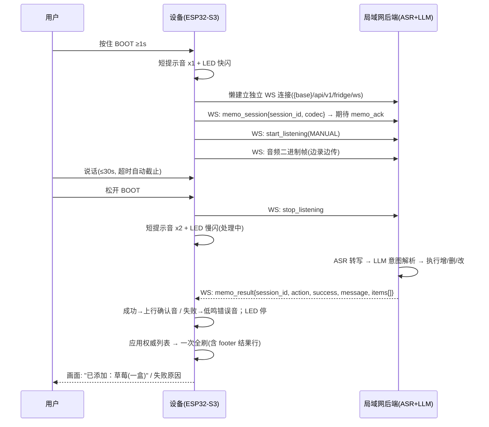
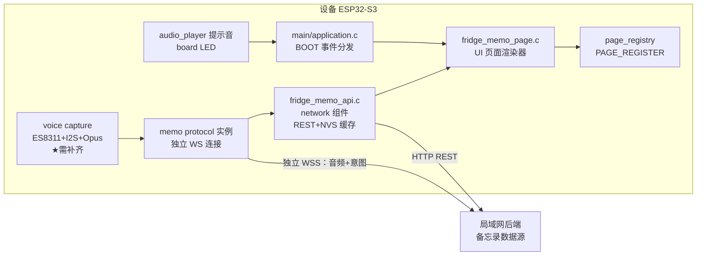

# 冰箱备忘录（Fridge Memo）产品设计文档

> 项目：ZecTrix EPD Panel（zetrix_epd_panel）
> 版本：v1.2（2026-08-16，UI/UX 评审修订版）
> 状态：已评审修订，待用户确认后进入实施计划
> 角色：产品设计 + 后端 API 契约定义（后端服务本身另行立项实现）

---

## 1. 背景与目标

### 1.1 背景

ZecTrix EPD Panel 是一台 4.2 寸四色电子纸（黑/白/红/黄，400×300）桌面设备，已有 19 个信息展示页面（天气、相册、日历、热点等）。设备具备板载麦克风（ES8311 编解码器）与局域网后端连接能力，且有提示音播放（`audio_player`）与活动 LED 可用作即时反馈通道。

本功能新增一个**冰箱备忘录页面**：把电子纸面板贴在冰箱上，作为家庭食物管理的低功耗常显终端。用户放入食物时按住 BOOT 键说一句话，后端 AI 自动解析并登记；家人随时看一眼屏幕，就知道什么食物放了几天、哪些快过期、哪些已经过期。

### 1.2 产品目标

1. **看得清**：一屏看清所有在存食物的存放时长与过期状态，红/黄色块在四色屏上形成强视觉分级。
2. **记得快**：说完话 → 确认音（数据已落库）**≤ 8 秒**；画面更新 **≤ 25 秒**（受一次 15~20s 物理全刷限制，确认音不依赖屏幕）。
3. **信得过**：后端为唯一数据可信源（source of truth），设备断电/重启后数据不丢，多终端（未来的手机端）与设备看到同一份数据。
4. **省电省刷**：所有交互遵守电子纸"低频全刷"物理约束，一次操作最多触发一次全屏刷新；中间状态反馈走提示音 + LED，不占用刷新。

### 1.3 非目标（本期不做）

- 跨页面的过期提醒（状态栏红点/弹窗）——设备无周期刷新源且深睡常态化，跨页提醒的刷新代价与功耗不可接受（见 §8）。
- 手机 App / 多终端 UI（后端契约已为其预留）。
- 温度传感器联动、条码/NFC 录入、摄像头识别。
- 语音播报（TTS 回放）——设备有音频播放能力，但备忘场景以"提示音 + 视觉"反馈为主，语音反馈列为未来扩展。
- 后端服务的实现（本文档只定义契约）。

---

## 2. 用户与场景

目标用户：家庭成员（做饭的人）。设备贴在冰箱门或厨房墙面。

| # | 用户故事 | 触发方式 |
|---|---------|---------|
| US-1 | 我把一盒草莓放进冰箱，想记下来 | 按住 BOOT 说"放了一盒草莓，能放三天"，松开 → 听到确认音，画面更新后列表出现新条目 |
| US-2 | 我想看看冰箱里还有什么没吃完 | 双击 UP 唤出快捷切换 → 进入"冰箱备忘"页，UP/DOWN 整页翻看列表 |
| US-3 | 酸奶已经喝完扔掉了 | 按住 BOOT 说"酸奶喝完了删掉"，或 BOOT 双击打开删除浮层选中该条目手动删除 |
| US-4 | 牛奶其实还剩半盒，明天就到期 | 按住 BOOT 说"牛奶还剩半盒，明天到期" → 更新数量与到期时间 |
| US-5 | 我不在家，想知道冰箱里还有啥 | （未来）手机打开后端 Web 页面看同一份数据 |

> 注：**所有语音操作都必须按住 BOOT**，设备无免提唤醒词。

---

## 3. 平台约束（设计的硬边界）

以下均来自当前代码库的既定事实，产品设计必须在其内运作：

| 约束 | 事实 | 对设计的影响 |
|------|------|------------|
| 屏幕 | 400×300，四色 BWRY（2bpp：00=黑 01=白 10=黄 11=红） | 过期=红、临期=黄的语义天然可用；无灰度渐变 |
| 刷新 | SSD2683 四色屏**不支持局部刷新**，全刷约 15~20s，**刷新期间按键响应等待** | 列表浏览必须用**整页翻页**模型（一行一选 = 每次 15~20s，不可接受）；中间状态反馈不能依赖屏幕 |
| 即时反馈通道 | 提示音（`audio_player_play_tone`，开机 1000Hz/100ms 实证可用）+ 活动 LED（`board_flash_activity_led`） | 语音流程的聆听/处理状态用**音 + LED** 表达，屏幕只在最终结果时刷一次 |
| 按键 | 仅 3 键：UP(GPIO39) / DOWN(GPIO18) / BOOT(GPIO0)，长按阈值 1000ms | 文字输入不可行 → 语音是唯一录入手段；按键只做浏览/删除 |
| 按键事件 | 现有 CLICK / DOUBLE_CLICK / LONG_PRESS（LONG_PRESS_START 触发）；**无"松开"事件** | "按住说话松开结束"需在 `main.c` 补注册 `BUTTON_LONG_PRESS_UP`（工程项，见 §6.4） |
| 唤醒行为 | 深睡由 BOOT（EXT1）唤醒，用户手指可能仍按住 | 唤醒后的首个 BOOT 按下需**吞掉**，否则开机即误入语音会话（工程项，见 §6.2/§8） |
| 语音链路 | WebSocket 协议层（`components/audio/protocol.c`）与流式文本管线已就绪，但**麦克风采集/Opus 编码处于 parked 状态**（原 C++ 版 Phase 4 未移植完） | 语音录入是本功能最大的工程增量（§6.4），里程碑上独立成期并先行 spike |
| 网络 | WiFi STA；对话服务 WSS URL 存于 NVS `websocket/url`；已有 HTTP 客户端工具（`http_client_util`） | 备忘录使用**独立 WS 连接**指向 `fridge/base_url`（见 §7.2），不与对话页共用连接 |
| 数据模式 | 既有"API 客户端异步拉取 + 回调注入页面 + NVS 缓存先行渲染"模式（coding_plan/weather） | 备忘录数据客户端完全复刻该模式（§6.2） |
| 电源 | 深睡常态化，BOOT 键唤醒后 RTC 恢复最后页面；唤醒后无周期刷新 | 数据新鲜度 = "进入页面时拉取"；缓存保证唤醒瞬间有内容可看；WS 连接懒建立、用后即断 |

---

## 4. 功能需求

### 4.1 条目展示

**条目数据字段**（与后端契约一致，见 §7）：

| 字段 | 类型 | 展示 |
|------|------|------|
| `id` | string | 不展示（删除操作用） |
| `name` | string(≤32 字符) | 主标题，如"草莓" |
| `quantity` | string(≤16) | 副文本，如"一盒"、"半盒" |
| `added_at` | ISO8601 日期 | "7/28 放入" |
| `expires_at` | ISO8601 日期，可空 | 推算剩余天数 |
| `note` | string(≤64)，可空 | 本期**不渲染**（字段保留，避免后端契约反复） |
| `storage` | string，可空（`"fridge"`/`"freezer"`） | 本期**不渲染**（预留"放冷冻层了"语义，见 §12） |

**设备端派生字段**（渲染时用本地 RTC 时间计算，不依赖后端重算）：

- `存放天数 = today - added_at + 1`（当天放入记 1 天）
- `剩余天数 = expires_at - today`；`< 0` → **已过期**，`0~2` → **临期**
- 时钟未同步（无 SNTP 且 RTC 掉电）时**不计算天数**，只显示日期；排序退化为按 `added_at` 倒序

**状态分级与排序**（四色语义，红最抢眼）：

| 状态 | 色彩 | 判定 | 排序权重 |
|------|------|------|---------|
| 已过期 | 红色块 + 红色文字"已过期 N 天" | 剩余天数 < 0 | 0（最顶） |
| 临期 | 黄色块 + 黑字"剩 N 天" | 0 ≤ 剩余 ≤ 2 | 1 |
| 正常 | 黑色块 + 黑字"剩 N 天"；无到期则只显示"放了 N 天" | 剩余 > 2 或无到期 | 2 |

组内按剩余天数升序（越紧急越靠上），无到期时间者按放入时间倒序排组尾。

**列表容量与分页**：单页最多条目 `FRIDGE_MEMO_MAX_ITEMS = 64`（定容数组，遵循项目 C 移植规范）；排序后按**每屏 4 条**切成页，UP/DOWN 整页翻动；超过 64 条只保留排序后最紧急的 64 条。空态显示居中 48px 麦克风图标（`font_zectrix` 图标集已有 `icon-mic`）+ 引导文案："按住 BOOT 说出冰箱里的食物\n例如：放了一盒草莓，能放三天"。

### 4.2 按键操作（手动，整页翻页模型）

| 操作 | 功能 |
|------|------|
| UP / DOWN 短按 | **整页翻动**（每次 4 条，触发一次全刷）；到首页/末页后再按无效（不空刷） |
| BOOT 短按 | 手动刷新：立即重新拉取后端数据（网络不可用时提示错误态，不空转） |
| BOOT 双击 | 打开**删除浮层**：列出本页 4 条，UP/DOWN 移动焦点（默认第一条），BOOT 短按确认删除选中条目，BOOT 双击取消（见 §5.3） |
| BOOT 长按（≥1s） | 进入语音录入（见 §4.3），松开结束 |
| UP / DOWN 长按 | 请求刷新后端数据（与天气页约定一致） |
| 语音会话期间 | UP/DOWN/BOOT 的一切按键事件**忽略**（输入锁定，见 §4.3） |

删除浮层内的目标选择：浮层本身就是确认步骤（标题写明操作提示，不再二次确认）。焦点每次移动触发一次全刷——用户已进入删除意图，接受该成本；语音删除仍是无刷新定位的主路径。手动删除走 REST `DELETE`（§7.1），成功后一次全刷；失败（离线）为 L2 失败（见 §8），红字 footer、条目保留。

### 4.3 语音操作（增 / 删 / 改）

**入口**：仅在冰箱备忘页生效（与相册页 BOOT 长按=传图、WiFi 页 BOOT 长按=配置的既有分发逻辑一致；其他页面 BOOT 长按行为不变）。

**反馈模型**：中间状态（聆听中/处理中）**不上屏**——电子纸刷新 15~20s，中途刷新会把流程卡死，而不刷新就不可见。中间状态用**提示音 + LED** 表达；屏幕只在最终结果（成功或 L2 失败）时刷新一次。

**流程**（按住 → 说话 → 松开 → AI 处理 → 结果反馈）：



**关键交互规则**：

1. **音效协议**：聆听开始 = 1 短音 + LED 快闪；松开（上传完毕进入处理）= 2 短音 + LED 慢闪；成功 = 上行双音（高→更高）；失败 = 低鸣单音。音效在打开/关闭录音通道**前后**播放，避免 ES8311 编解码器模式冲突（工程注意，见 §6.4）。
2. **懒连接**：独立 WS 连接在 BOOT 长按瞬间建立（LAN 内握手数百毫秒，落在用户开口之前），`memo_result` 或超时后即断开，不常驻——深睡常态化的设备不为低频功能养连接。
3. **录音上限 30s**：到时自动 stop，等同松开。
4. **意图结果以 `message` 呈现**：成功显示"已添加：草莓（一盒）"、"已删除：酸奶"、"已更新：牛奶（半盒，明天到期）"；失败显示原因（"没听清，请再说一次" / "未找到叫 XX 的食物" / "后端不可达"）。结果行常驻列表底部 footer，直到下次操作或翻页。
5. **输入锁定**：语音会话从 BOOT 长按生效起至最终结果/超时止，UP/DOWN/BOOT 全部按键事件忽略；会话结束后**抑制一次 BOOT 短按**（复用 `main.c` 既有 `s_suppress_*` 模式），防止松开手势尾随触发"手动刷新"。
6. **一句话多操作**：契约允许后端一次返回多条操作结果（`action` 可为 `batch`），设备只认最终 `items[]` 权威列表，无需自己合并 diff。
7. **会话标识**：设备生成 `session_id`（时钟 + 计数器）随 `memo_session` 上行，后端在 `memo_result` 中回显；不匹配的下行包丢弃（陈旧会话防护）。
8. **结果归位**：语音操作成功应用权威列表后**回到第 1 页**——列表按紧急度重排会使当前页内容漂移，回到首页保证行为可预测（变更大概率落在首页视角）。

### 4.4 数据同步与缓存

- **拉取时机**：进入页面（含深睡唤醒恢复到本页）→ 先渲染 NVS 缓存 → 异步拉取最新 → 有变化才刷新屏幕。
- **缓存**：NVS 命名空间 `fridge_memo`，键 `items`（整包 JSON），完全复刻 `coding_plan_api` 的"缓存先行渲染"模式。
- **权威性**：语音操作的结果包与所有 REST 响应（含 404）**总携带全量 `items[]`**，设备整包覆盖缓存——设备端永远不做条目级合并，消除不一致。

---

## 5. UI 设计

### 5.1 页面线框（400×300，整页翻页模型）

```
┌──────────────────────────────────────────┐
│ ▌冰箱备忘          8月12日 周三  ▮▮ 🔋97% │  ← 状态栏（复用）
├──────────────────────────────────────────┤
│ ■ 2 过期 · ■ 1 临期 · 共 9 项             │  ← 汇总条 22px（■=红/黄色块）
├──────────────────────────────────────────┤
│ ████ 酸奶（5 连杯）            已过期 3 天 │  ← 红 = 状态文字红色，名称也红
│ ████ 7/28 放入 · 已存 16 天               │
│ ▒▒▒▒ 牛奶（半盒）                剩 1 天  │  ← 黄 = 临期
│ ▒▒▒▒ 8/10 放入 · 已存 3 天                │
│ ▒▒▒▒ 草莓（一盒）                剩 2 天  │  ← 剩 2 天仍属临期（黄）
│ ▒▒▒▒ 8/11 放入 · 已存 2 天                │
│ ▓▓▓▓ 鸡蛋（10 个）              剩 15 天  │  ← 黑 = 正常
│ ▓▓▓▓ 8/05 放入 · 已存 8 天                │
├──────────────────────────────────────────┤
│ 🎤 按住 BOOT 说话登记    第 1/3 页 UP/DN 翻页│  ← footer 默认态
└──────────────────────────────────────────┘
```

**排版规格**（字体为硬约束——项目文本字体仅两档，见 zetrix_fonts）：

| 元素 | 字体/字号 | 说明 |
|------|----------|------|
| 条目名称 | `SourceHanSansSC_Medium_slim` 24px | 过期态名称文字变红（三重编码之一） |
| 数量 | `SourceHanSansSC_Regular_slim` 16px | 跟随名称，同基线 |
| 状态文字 | Medium 16px，行 1 右对齐 | 过期红 / 其余黑："已过期 3 天"、"剩 2 天"（扫视锚点，置于首行右端） |
| 次要行 | Regular 16px，secondary 色 | "7/28 放入 · 已存 16 天"（原始需求要求展示放入时间与存放天数） |
| 汇总条 | Regular 16px + 12px 色块 | 行高 22px；无过期/临期时仅"共 N 项" |
| 条目行高 | 52px（24+16+12 padding） | 每屏 4 行 |
| footer | Regular 16px（复用 `footer_bar` 控件左右槽） | 行高 26px |

纵向预算：状态栏 ~34 + 汇总 22 + 4×52=208 + footer 26 ≈ 290 ≤ 300 ✓。**每屏 4 行是定论**：原始需求要求同时显示放入时间+存放天数（双行必须），5 行双行需 260px 超出可用 ~218px；单行 7 行方案会丢日期信息，不采纳。

### 5.2 语音反馈（音 + LED，不上屏）

电子纸无法表达瞬时状态，语音会话全程用音频与 LED 反馈，屏幕保持旧画面直到最终结果：

| 阶段 | 提示音（频率/时长） | LED |
|------|---------------------|-----|
| 聆听开始（BOOT 长按生效） | 880Hz / 80ms ×1 | 快闪 |
| 松开、进入处理 | 660Hz / 60ms ×2（间隔 80ms） | 慢闪 |
| 成功（memo_result 到达） | 880Hz / 80ms → 1318Hz / 120ms（上行双音） | 停 |
| 失败（含超时） | 233Hz / 300ms（低鸣单音） | 停 |

- 提示音用 `audio_player_play_tone()`（100ms 级短音），在录音通道开/关**前后**播放，避免 ES8311 播放/录音模式冲突。
- LED 模式（快闪/慢闪/停）需在现有 `board_flash_activity_led` 基础上扩展节拍控制（工程项，见 §6.2）。
- 最终结果（成功或 L2 失败）随列表更新触发**恰好一次全刷**，footer 显示 `message`。频率/时长为实现参考值，可在联调期微调，但**四种音型的相对差异**（短促开始 / 双击处理 / 上行成功 / 低鸣失败）固定不变，保证可学习性与说明书可写。

### 5.3 删除浮层（本页条目选择 + 确认合一）

用 `modal` 控件做居中容器（标题"UP/DN 选 · BOOT 删 · 双击取消"），内容区自绘本页 4 条目行（名称+数量+状态，焦点行反白高亮）。UP/DOWN 移动焦点（默认第一条，每次移动一次全刷）；BOOT 短按对焦点条目执行 REST DELETE（浮层即确认，无二次弹窗）；BOOT 双击取消返回列表。焦点移动刷新成本：选第 1 条 = 打开+结果 2 刷，最坏选第 4 条 = 4 刷——语音删除仍是首选路径，浮层是离线/不想说话时的等价能力兜底。

### 5.4 状态汇总

| 状态 | 表现 |
|------|------|
| 空列表 | 居中 48px 麦克风图标 + 引导文案 + 语音示例 |
| 离线（后端不可达） | 黄色 footer 横幅 + 缓存时间；语音/删除操作失败音 + L1/L2 规则（见 §8） |
| 时钟未同步 | 天数显示"—"，只显示日期；排序退化为放入时间倒序 |
| 条目超 64 | 只展示前 64 条（排序后最紧急的），footer 提示"共 N 条，仅显示最紧急 64 条" |
| 语音会话中 | 屏幕无变化（旧画面保持）；音 + LED 反馈；按键锁定 |
| 删除浮层开启 | BOOT 长按（语音入口）禁用——失败音提示，不动作；UP/DOWN/BOOT 双击正常响应 |
| footer 左槽优先级 | 操作结果 > 离线横幅（含缓存时间）> 默认语音提示"🎤 按住 BOOT 说话登记" |

---

## 6. 架构与代码落点（设备端）

### 6.1 模块图



> 与对话页的关系：对话页继续用 `websocket/url` 的既有 WS 连接与 `protocol_t` 实例，互不影响；备忘语音用**第二个 `protocol_t` 实例**（消息格式复用，连接独立），指向 `fridge/base_url` 派生的 WS 端点。

### 6.2 新增/改动文件

| 文件 | 动作 | 内容 |
|------|------|------|
| `components/ui/include/ui_manager.h` | 改 | `ui_page_id_t` 增加 `UI_PAGE_FRIDGE_MEMO`（置于 `UI_PAGE_COUNT` 前） |
| `components/ui/pages/fridge_memo_page.c/.h` | 新 | 页面渲染器：整页翻页列表、色条、页指示、footer、空态、删除确认框；结尾 `PAGE_REGISTER(UI_PAGE_FRIDGE_MEMO, "冰箱备忘", NULL, true, 25, ...)`（order=25，排在天气 20 与日历 30 之间；图标 P0 用 NULL，与热点/老黄历等页一致） |
| `components/network/fridge_memo_api.c/.h` | 新 | REST 客户端：`GET/DELETE items`、NVS 缓存读写、异步回调注入页面（复刻 `coding_plan_api` 模式：`*_api_init/_fetch_async/_has_cached_data/_get_cached_data/_set_callback`）；`base_url` 读取与 WS 端点派生 |
| `components/audio/protocol.c/.h` | 改 | 增加 URL 注入接口（如 `protocol_set_url()`，`protocol_init` 现从 `websocket/url` 硬读）；增加 `memo_session` 发送与 `memo_result`/`memo_ack` 分发到注册回调 |
| `components/audio/voice_capture.c/.h` | 新 ★ | ES8311 ADC + I2S 采集 + Opus 编码（原 C++ audio_service 未移植部分的最小集），输出帧喂给 memo protocol 实例的 WS 二进制通道 |
| `main/main.c` | 改 | BOOT 按钮补注册 `BUTTON_LONG_PRESS_UP` 回调 → `application_on_boot_release()`；唤醒后吞掉首个 BOOT 按下（抑制开机误入语音会话） |
| `main/application_internal.h` | 改 | 事件枚举加 `APP_EVENT_BOOT_RELEASE`；`application_t` 挂第二个 `protocol_t`（memo）与语音会话状态 |
| `main/application.c` | 改 | BOOT 长按分支加 `boot_page == UI_PAGE_FRIDGE_MEMO` → 启动语音会话（懒建 WS + 提示音 + LED）；BOOT release → 结束录音；会话结束抑制一次 BOOT click；`app_sync_on_data_refresh_request` 加 `UI_PAGE_FRIDGE_MEMO` 拉取路由 |
| `main/app_sync.c` | 改 | 页面进入时的数据拉取编排（缓存先行） |
| `main/app_settings_menu.c` | 改 | P0 即提供 `fridge/base_url` 设置项（与 `websocket/url` 同一配置交互模式） |
| `components/bsp_board`（LED 接口） | 改 | 扩展活动 LED 节拍模式（快闪/慢闪/停） |
| `components/ui/CMakeLists.txt` | 改 | SRCS 加新页面 |
| `tests/test_fridge_memo.c` | 新 | 主机端测试（§10） |

### 6.3 数据流（进入页面）

`深睡唤醒/切页` → `app_sync` 读 NVS 缓存 → `fridge_memo_page_update()` 渲染（若与当前帧不同才请求刷新）→ 异步 `GET /items` → 回调对比 → 变化则更新页面 + 一次全刷。

### 6.4 关键工程依赖：麦克风采集链路（★ 本功能最大增量）

当前仓库音频栈状态（`application.h` 注释原话："Phase 4 text skeleton; audio/Opus deferred"）：

- ✅ 已有：WSS 协议消息层（hello/listen/text）、流式文本分块、ES8311 播放（`audio_player`）、esp_codec_dev 集成。
- ❌ 缺失：**麦克风 ADC 采集 → Opus 编码 → WS 二进制帧上行**。

需补齐（约束提醒：ES8311 I2C 地址填 `0x30`；DMA 缓冲 4 字节对齐；避免在 esp_timer 上下文做重活）：

1. ES8311 录音通道打开（`esp_codec_dev` open for record, 16kHz/16bit 单声道起步）。
2. I2S 环形缓冲采集任务（独立 FreeRTOS task，优先级低于刷新任务）。
3. Opus 编码器（24000Hz / 60ms 帧，与 `protocol_t.server_sample_rate/server_frame_duration` 对齐）。
4. 编码帧 → `protocol` WS 二进制发送接口（新增 `protocol_send_audio_frame()`）。
5. 提示音与录音通道的时序：音效在录音 open 之前 / close 之后播放，避免 ES8311 同时切换播放/录音模式的驱动竞争。

若 Opus 编解码器体积/算力不达标，降级方案：PCM 16k 上行（带宽 ≈ 32KB/s，局域网可承受），后端侧转码——编码模式在 `memo_session.codec` 中向 后端声明，契约不变。此决策留待 P1a spike 验证。

---

## 7. 后端 API 契约

Base URL：NVS 命名空间 `fridge`，键 `base_url`（如 `http://192.168.1.10:8420`），设置页提供配置项（P0 交付，与 `websocket/url` 同一配置交互模式）。REST 与 WS 同源：WS 端点 = `{base}/api/v1/fridge/ws`。

**安全模型**：家庭局域网信任模型——契约支持可选 `X-Auth-Token` 请求头（REST）与 `memo_session.token` 字段（WS）；设备侧本期不实现 token 配置 UI，明示接受 LAN 内可读写风险（后续可低成本加固）。

### 7.1 REST（数据面）

```
GET  {base}/api/v1/fridge/items
     → 200 {"updated_at": "2026-08-12T08:30:00+08:00",
            "items": [ {
              "id": "f_001", "name": "草莓", "quantity": "一盒",
              "added_at": "2026-08-11", "expires_at": "2026-08-14",
              "note": "", "storage": "fridge" } ] }
     （列表按后端排序规则返回；设备端仍按 §4.1 自行排序展示）

DELETE {base}/api/v1/fridge/items/{id}
     → 200 {"ok": true,  "updated_at": "...", "items": [...]}   ← 响应携带全量列表
     → 404 {"ok": false, "updated_at": "...", "items": [...]}   ← 同样携带权威全量；
                                                                   设备整包覆盖（目标已消失即达成）

错误码：503 后端维护中；5xx 统一按"后端不可达"处理。所有 2xx/404 响应都携带全量 items[]。
```

### 7.2 WebSocket（语音面，独立连接 + Xiaozhi 协议消息格式复用）

连接：`{base}/api/v1/fridge/ws`；按需建立（BOOT 长按时），`memo_result` 或超时后断开。

**上行（设备 → 后端）**：

```jsonc
// 1) 会话声明（start_listening 之前发送）
{"type": "memo_session",
 "session_id": "1755000000-0042",   // 设备生成：时钟 + 计数器；memo_result 回显校验
 "page": "fridge_memo",
 "codec": "opus",                    // "opus" | "pcm16"（降级模式），音频帧格式见下
 "sample_rate": 24000, "frame_ms": 60}

// 2) 开始/结束聆听（复用既有消息，mode=1 即 PROTO_LISTENING_MANUAL）
{"type": "start_listening", "mode": 1}
{"type": "stop_listening"}

// 3) 音频：WS 二进制帧，每帧恰为一个编码单元（Opus 包或 16bit PCM 块），
//    编码方式以 memo_session.codec 声明为准，不带额外语义帧头
```

**下行（后端 → 设备）**：

```jsonc
// 会话确认（memo_session 的即时应答；不支持备忘能力时 ok=false）
{"type": "memo_ack", "session_id": "...", "ok": true}

// 意图执行结果
{
  "type": "memo_result",
  "session_id": "...",            // 回显，设备校验是否当前会话，不匹配丢弃
  "action": "add | delete | update | batch | none",
  "success": true,
  "message": "已添加：草莓（一盒）",   // 直接展示给用户的中文短语，≤32 字符
  "asr_text": "放了一盒草莓能放三天",   // 可选，调试/透明度用
  "items": [ /* 与 GET /items 同构的全量列表 */ ]
}
```

**语义规则**：

- `items` 永远为操作后的权威全量（包括失败时也应携带当前列表，设备可顺带纠偏）。
- `action=none, success=false` 表示 AI 无法解析意图，`message` 给出原因。
- 会话握手失败（`memo_ack.ok=false` 或超时无 ack）→ 设备按 L1 失败处理（失败音，不发音频）。
- ASR/LLM 的多候选歧义（如"删除酸奶"但有两条酸奶）由后端在 `message` 中追问，设备把追问文本原样显示在 footer，用户再按住 BOOT 补充说明——设备不做结构化追问 UI。

---

## 8. 错误处理与边界

**两级失败模型**（反馈强度与用户已投入的成本匹配）：

| 级别 | 定义 | 反馈 |
|------|------|------|
| L1 立即失败 | 未消耗用户说话成本：WS 不可达 / `memo_ack` 失败 / 录音 < 1s 误触 | 失败音，**不刷新**；错误文案暂存 footer，随下一次自然刷新（进页/翻页）显示 |
| L2 会话失败 | 用户已说完并等待：`memo_result` 超时（15s）/ ASR 失败 / 意图失败 / 删除离线 | 失败音 + **一次全刷**显示 footer 原因 |

**边界场景**：

| 场景 | 行为 |
|------|------|
| WS 建连失败时按住 BOOT | L1：失败音，不发音频，不刷新 |
| 录音中 WS 断开 | 结束会话，L2：footer 红字"连接中断，本次未记录" |
| `memo_result` 超时（15s） | L2：footer"处理超时，请重试"，列表保持旧值 |
| `memo_result.session_id` 不匹配 | 静默丢弃（陈旧会话包），等待当前会话结果 |
| `memo_result.items` 解析失败 | 丢弃该包，列表不动，footer"结果异常，已忽略"（宁旧勿错） |
| REST 拉取失败 | 保留缓存 + 黄色离线提示 |
| 删除返回 404 | 与 200 同路径：整包应用响应内 `items[]`（目标消失即达成） |
| 时钟未同步（无 SNTP 且 RTC 掉电） | 不计算天数，只显示日期；排序退化 |
| 条目名超长 | 渲染截断加"…"，不换行 |
| 深睡中数据变化 | 唤醒进页时拉取纠正；缓存先显示保证不白屏 |
| 录音 < 1s（误触） | L1：不发送，失败音，footer"说话时间太短"（暂存） |
| 深睡经 BOOT 唤醒、手指仍按住 | 唤醒后吞掉首个 BOOT 按下（直到首次松开），防止开机误入语音会话 |
| 语音会话中按键 | 全部忽略（输入锁定）；会话结束抑制一次 BOOT click |
| 删除浮层开启时 BOOT 长按 | 语音入口禁用：失败音，不进入语音会话 |

**刷新策略汇总**（对应 §3 约束）：进入页面（缓存→网络）最多 1 次全刷；整页翻动 1 次；语音全流程恰好 1 次全刷（仅最终结果；L1 失败 0 刷）；删除浮层 = 打开 1 + 每次焦点移动 1 + 确认结果 1（选页首项共 2 刷，最坏 4 刷）；BOOT 短按手动刷新 1 次；聆听/处理中间态 0 刷（音 + LED）。开机首帧沿用现有 2s 首刷合并窗口，不新增机制。

---

## 9. 隐私

- 语音音频仅在局域网内传输（独立 WS 指向用户自建后端）；后端契约要求：音频在意图解析完成后即丢弃，ASR 文本与 `note` 类备注保留期限由后端实现方声明并写入其隐私说明。
- 设备端不持久化任何音频；NVS 只存条目结构化数据。

---

## 10. 验收标准与测试

**功能验收（设备端）**：

1. 快捷切换出现"冰箱备忘"，排序位于天气之后；进入显示缓存（无网也有上次的数据）。
2. UP/DOWN 整页翻动 4 条/页，footer 页指示正确；首页/末页再按不触发空刷。
3. BOOT 双击 → 删除浮层列出本页 4 条 → UP/DOWN 移动焦点（反白高亮）→ BOOT 确认删除选中项、一次全刷；离线时删除失败红字、条目保留；浮层内 BOOT 长按被禁用（失败音）。
4. 构造过期条目（后端注入 `expires_at` 为昨天）→ 红色块置顶 + "已过期 1 天"；构造剩 2 天条目 → **黄色临期块**（非黑）。
5. 语音"放了一盒草莓，能放三天"：松开后 ≤ 8s 听到成功音；画面 ≤ 25s 更新，footer"已添加：草莓（一盒）"，整个过程恰好一次全刷。
6. 语音"酸奶喝完了删掉" → 条目消失；说"牛奶还剩半盒明天到期" → 数量与到期日更新。
7. 拔掉后端（断网）：进入页面显示缓存 + 黄色离线 footer；按住 BOOT → 失败音、不刷新；翻页后可见暂存的错误文案。
8. 深睡唤醒恢复到本页 → 先显缓存后异步纠正。
9. 深睡经 BOOT 唤醒（手指保持按住）→ 开机**不**进入语音会话；松开后再按住才生效。

**测试计划（主机端，`tests/run_tests.sh` 接入）**：

- `test_fridge_memo.c`：JSON 解析（GET 响应/memo_result 全量覆盖/畸形包丢弃/session_id 不匹配丢弃/404 带全量）、天数计算（过期/临期/当天/跨月/时钟未同步退化排序）、排序稳定性（红>黄>黑、组内升序）、汇总统计（过期/临期/总数与条目集一致性）、分页数学（页数/边界页条目数/翻页不越界）、删除浮层焦点循环（4 条环绕/确认目标=焦点条目）、定容数组边界（>64 条截断）、页面渲染冒烟（空态/满页/翻页态/浮层态，仿 `test_ui_pages_smoke.c`）。
- 设备端冒烟：真机跑 §10 功能验收 1–9。

---

## 11. 里程碑

| 阶段 | 内容 | 交付判据 |
|------|------|---------|
| **P0 只读展示** | 页面 + 汇总条 + 整页翻页 + REST 客户端 + NVS 缓存 + 快捷切换 + `base_url` 设置项 + 删除浮层（本页选条目手动删除） | 验收 1、2、3、4、8；主机测试通过；mock JSON 驱动 |
| **P1a 音频链路 spike** | 麦克风采集 → 编码（Opus/PCM 对比验证）→ 独立 WS 上行 → 服务端日志可见音频 | 端到端音频可达；产出 Opus vs PCM 决策（RAM/闪存/算力/带宽数据） |
| **P1b 语音全流程** | `BUTTON_LONG_PRESS_UP` + 懒连接 + 音效/LED 协议 + memo_result 分发 + 输入锁定/唤醒抑制 | 验收 5、6、7、9；录音→成功音 ≤ 8s、画面 ≤ 25s |
| **P2 打磨** | 后端联调（ASR/LLM 意图准确率调优）、结果文案打磨 | 意图解析准确率 ≥ 90%（评测集：增/删/改各 20 条）；语音一次成功率（后端日志口径）≥ 80%；周登记条目数作为北极星指标开始记录 |

P0 与 P1a 可并行（P0 用本地 mock JSON 驱动；P1a 不依赖 UI）。

---

## 12. 未来扩展（backlog，非本期承诺）

- 状态栏过期红点 + 唤醒时摘要播报（需引入受控的唤醒刷新策略）
- 语音 TTS 确认播报；多用户语音声纹区分（"爸爸放的酸奶"）
- 后端 Web/手机端管理页（契约已就绪）；条目图片（传图管线已存在，可复用）
- `storage` 字段激活（冷藏/冷冻分层显示与保质期差异推断——契约已预留）
- 按食材类目的常见保质期知识库优化推断；临期菜谱推荐（后端能力）
- 若未来面板硬件支持局部刷新，可重估"浮层/行选"等更细交互

---

## 附录 A：术语

| 术语 | 含义 |
|------|------|
| 全刷 | 四色电子纸整屏刷新，约 15~20s，期间画面保持、按键等待 |
| 权威列表 | 后端返回的操作后全量 `items[]`，设备整包覆盖本地 |
| 临期 | 剩余天数 0~2 的条目（阈值可由后端按食材覆写，本期全局常量） |
| L1/L2 失败 | 立即失败（未消耗说话成本，仅失败音）/ 会话失败（已说完等待，失败音 + 一次全刷说明原因） |
| 页模型 | 以 4 条/页为选区的整页翻页交互（对应行级光标模型） |
| 懒连接 | WS 连接在 BOOT 长按瞬间建立、结果或超时后断开，不常驻 |
| parked | 原 C++ 工程中规划但未移植到 C 的模块（麦克风采集链路） |

---

## 修订记录

| 版本 | 日期 | 变更 |
|------|------|------|
| v1.0 | 2026-08-12 | 初稿（设备端设计 + 后端 API 契约） |
| v1.1 | 2026-08-16 | PO 评审修订：①中间状态反馈从"不可见的帧缓冲浮层"改为**提示音 + LED**（原方案在电子纸上物理不可见）；②时效目标拆分为"确认音 ≤8s / 画面 ≤25s"（原"<15s 含全刷"算术不成立）；③列表浏览从行选滚动改为**整页翻页**（行选 = 每条 15~20s 刷新，不可用）；④语音 WS 改为**独立连接**指向 `fridge/base_url`（避免与公网对话服务共址导致 memo 消息失效）；⑤404 响应同样携带权威全量，删除"本地移除"特例（与"设备永不做条目合并"矛盾）；⑥契约补齐：`session_id` 上行生成与回显校验、`codec` 声明、`memo_ack` 握手、两级失败模型；⑦`base_url` 设置项移入 P0；⑧新增：语音会话输入锁定、会话结束 BOOT click 抑制、BOOT 唤醒首按吞掉、`note`/`storage` 字段本期不渲染；⑨里程碑拆出 P1a 音频 spike；⑩P2 增加可测成功指标；⑪修正线框临期配色（剩 2 天 = 黄非黑）与笔误 |
| v1.2 | 2026-08-16 | UI/UX 评审修订：①BOOT 双击改为**删除浮层**（本页 4 条内 UP/DN 选焦点，浮层即确认）——修复"仅能删本页第一条"导致 75% 条目手动删除不可达的缺陷；②状态栏下新增 22px **汇总条**（过期/临期计数 + 总数）服务 3 秒扫视；③行内层级重排：状态文字（剩 N 天/已过期）移至首行右对齐扫视锚点，日期+存放天数降为次行次要信息；④补排版规格：名称 Medium 24px / 正文 Regular 16px（项目仅两档字体）、行高 52px、纵向预算 290≤300，4 行/屏为字体+双行需求的定论；⑤footer 左槽默认态 = "🎤 按住 BOOT 说话登记"（icon-mic 已有）提升语音入口可发现性，并定义三态优先级；⑥空态加 48px 麦克风图标；⑦删除浮层开启时语音入口禁用；⑧语音成功后回到第 1 页（防内容漂移）；⑨音效协议补频率/时长规格；⑩按键提示对齐设备惯例"UP/DN 翻页" |
